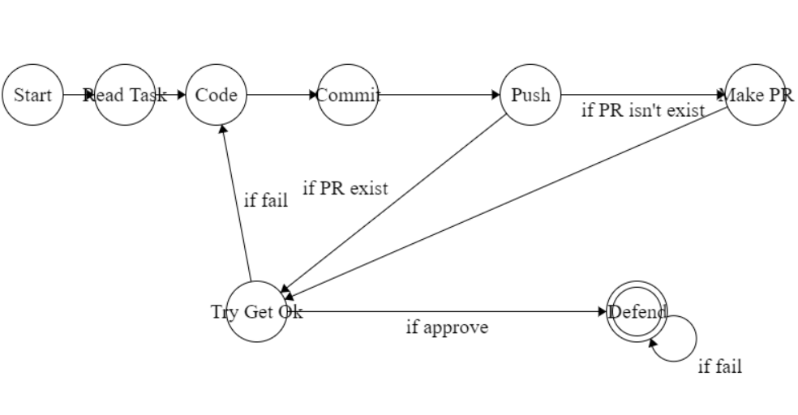

# Конечные автоматы и регулярные выражения

## Пререквизиты

- [Машина Тьюринга](../turing_machine/)

---

В этой задаче узнаем про математическую модель конечного автомата, а также про технологию на ней построенной - регулярные выражения.

> Ниже будет использоваться зарубежная терминология - *Finite State Machine(FSM)*

## Finite State Machine
Это абстракция, позволяющая описывать алгоритм. Представляет собой множества состояний, алфавит и переходы.

*Ничего не напоминает?*

Любой алгоритм можно представить в виде автомата. Если у Вас не появилось чувство дежавю, то поясню - похоже на машину Тьюринга. И не просто похоже: машина Тьюринга является автоматом, только более продвинутым: с бесконечной памятью(бесконечная лента) и универсальностью (на ней можно эмулировать любые вычисления).

## Практическое применение
На FSM строятся регулярные выражения, которые позволяют искать в тексте по паттерну.   
Помимо этого FSM применяются в синтаксических анализаторах, применяемых в компиляторах.    
Stackless корутины в языках С++, Kotlin, Python также используют идею FSM     

А ещё ею удобно описывать сложные системы. Ниже изображён FSM сдачи ваших задач:


## `FSM на Си`
Состояния удобно изображать в виде enum. Это аналогично доменным именам - людям проще запоминать имя сайта, чем его IP-адрес. Например, структура состояний для FSM выше будет выглядеть так:
```C
typedef enum{
    START,
    READ_TASK,
    CODE,
    COMMIT,
    PUSH,
    MAKE_PR,
    TRY_GET_OK,
    DEFEND
} State
```

- Прочитайте про [Enum](https://www.geeksforgeeks.org/enumeration-enum-c/), если плохо с ними знакомы.

Для переходов можно использовать условную логику. Так как условий довольно много, удобно использовать конструкцию switch case:
```C
State state = START;
switch(state){
    case START:
        // what are we going to do there?
        ...
        state = READ_TASK;
        break;
    case READ_TASK:
        ...
}
```

- Освежите знания про [switch](https://www.geeksforgeeks.org/c-switch-statement/). 
Однако такой подход не рекомендуется - код получается чертовки запутанным, поддерживать его невероятно сложно.

На занятии будет разработан более удобный дизайн конечного автомата.

**Постарайтесь называть свои состояния осмысленными словами, из которых будет понятно, что в них выполняется.**

## `Регулярные выражения`

Мы уже использовали регулярные выражения в рамках задач на утилиты Linux. Такой же инструмент есть в Си(и в большинстве языков программирования). 

Нам поможет библиотека ```regex.h```.
- Прочитайте про использование [regex](https://www.scaler.com/topics/c-regex/) в Си.

*Обратите внимание, что семантика шаблонов отличается от масок файлов.*


Также заметьте, что знакомая нам ```scanf()``` умеет принимать регулярки, фильтруя то, что поступает на вход.

Однако в Си регулярки сырые и не дают большого функционала. В качестве упражнения, составьте регулярное выражение, которое будет "матчить" слово, которое вам нужно найти в задании.   
Свою регулярку поместите в комментарии в `Task()`. Также укажите в комменатриях, на каких строках вы её тестировали

## `regex.com`
На этом сайте можно составить регулярку и удобно её протестировать.

- Для ознакомления со всем функционалом регулярок, рекомендую [эту](https://www.youtube.com/watch?v=ciz9VFwsPmU&list=PLLguubeCGWoaGFEDzduGmBhEgZ62p-Jqv&index=3) лекцию.

## Задание

Вам необходимо решить задачу вашего варианта. Свой вариант можно найти [тут](variants.md).

## Важные требования к решению
Чтобы получить максимальный балл за задачу, необходимо удовлетворять следующим критериям:
- Использовать проверку на вхождение регулярными выражениями.
- Код должен быть понятным, названия переменных отражают то, что они хранят.
- Нарисуйте диаграмму своего FSM. Удобно это сделать [тут](https://madebyevan.com/fsm/).

Не выполнение любого из этих условий может служить поводом для снижения итогового балла. Или не может, если Вы умеете грамотно защищать свою точку зрения :=)

### Файл reg.h стоит игнорировать

## Задача на подумать

Зная, как реализуется FSM и понимая, что машина Тьюринга - FSM: сможете реализовать машину Тьюринга на Си?


