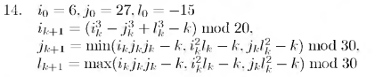

# Вариант № 14
**Сложность:** Стандартный

**Задание:**: Проверить попадание точки в указанную область за ограниченное число итераций (50).

`Область`: Лунка, являющиеся пересечением двух кругов радиуса 10, центр первого круга - в точке (-10 -10), центр второго - в точке (-20, -20)   
 
`Изменение координат`:  

---