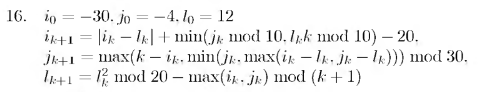

# Вариант № 16
**Сложность:** Стандартный

**Задание:**: Проверить попадание точки в указанную область за ограниченное число итераций (50).

`Область`: Полоса, ограниченная прямыми i + j + 10 = 0 и i + j + 20 = 0   
 
`Изменение координат`:  

---