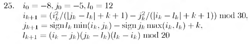

# Вариант № 25
**Сложность:** Стандартный

**Задание:**: Проверить попадание точки в указанную область за ограниченное число итераций (50).

`Область`: Треугольник с вершинами в точках (-10, 0), (0, 10), (-10, 20)   
 
`Изменение координат`:  

---