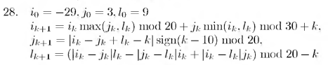

# Вариант № 28
**Сложность:** Стандартный

**Задание:**: Проверить попадание точки в указанную область за ограниченное число итераций (50).

`Область`: Эллипс с центром в точке(20, 0) и проходящий через точки  
(10, 0), (30, 0), (20, 5) и (20, -5)   
 
`Изменение координат`:  

---