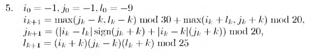

# Вариант № 5
**Сложность:** Стандартный

**Задание:**: Проверить попадание точки в указанную область за ограниченное число итераций (50).

`Область`: Кольцо, ограниченное двумя окружностями с центром в точке (10, 10), радиус внутренней окружности равен 5, а радиус внешней равен 10.   
 
`Изменение координат`:  

---