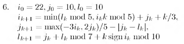

# Вариант № 6
**Сложность:** Стандартный

**Задание:**: Проверить попадание точки в указанную область за ограниченное число итераций (50).

`Область`: Квадрат с длиной стороны 10, стороны квадрата параллельны осям координат, центр квадрата в точке (10, 10).   
 
`Изменение координат`:  

---