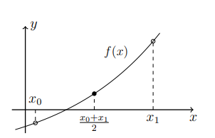

# Численные методы решения уравнений

## Пререквизиты

- [Тэйлор](../taylor/)

---

## Нелинейные уравнения
Будем рассматривать нелинейное уравнение вида:
$$f(x) = 0$$

Необходимо найти решение уравнения численным методом.

### `Метод дихотомии`
1) Выберем такой отрезок $$[x_0, x_1],$$ на границах которого функция `f(x)` принимает значения разного знака, иначе говоря: $$f(x_0) \cdot f(x_1) < 0$$
2) Разобьём этот отрезок пополам и выберем тот отрезок, в котором условие выше всё ещё выполняется.
3) Повторить шаг 2, пока не будет достигнута заданная точность: $$|x_0 - x_1| < \varepsilon $$



> Каждым таким делением всё ближе и ближе подходим к значению, где график пересекает ось Ox в нуле - это точка и есть решение уравнения.

### `Метод простых итераций`
Заменим исходное уравнение на другое, но с теми же корнями: $$f(x) = 0 \rightarrow x = \phi(x)$$

Для сходимости необходимо и достаточно: 
$$|\phi'(x)| < 1, x \in [a, b]$$ 

Будем искать следующее приближение по формуле: $$x_{n+1} = \phi(x_n), n = 0,1,2,...$$

Получаем последовательность: $$\{x_n\}$$
Предел данной последовательности и есть решение уравнения: $$x = \lim\limits_{n\to\infty}{x_n}$$

Иначе говоря:
- Начальное приближение: $$x_0 = \frac{a + b}{2}$$
- Итерационный процесс: $$x_{n + 1} = \phi(x_n)$$
- Критерий остановки: $$\left|\frac{x_{n+1} - x_n}{1 - \frac{x_{n+1} - x_{n}}{x_{n} - x_{n-1}}}\right| < \varepsilon$$

### `Метод Ньютона`
Разложим функцию `f(x)` в ряд Тэйлора в окрестности некоторой точки `Xn`: $$f(x) \approx f(x_n) + f'(x_n)\cdot(x - x_n)$$
Потребуем $$f(x_{n + 1}) = 0$$
Тогда итерационный процесс: $$x_{n+1} = x_n - \frac{f(x_n)}{f'(x_n)}$$

Алгоритм простой:
1) Выбрать любой `x0`
2) Повторять итерационный процесс, пока не выполнится критерий остановки.

Так как метод Ньютона - частный случай метода итераций, то критерий остановки аналогичный:
$$\left|\frac{x_{n+1} - x_n}{1 - \frac{x_{n+1} - x_{n}}{x_{n} - x_{n-1}}}\right| < \varepsilon$$

## Передача функции параметром в другую функцию
Указатель на функции можно передавать в качестве параметра. Синтаксис следующий:
```c
void func(ret_val(*name)(params*)){
    ...
}
```

Пример:
```c
void swap(int32_t* a, int32_t* b){
    *a = *a ^ *b;
    *b = *b ^ *a;
    *a = *a ^ *b;
}

int8_t comparator(int32_t a, int32_t b){
    return a < b;
}

// Тут передаём comparator в качестве параметра для сортировки
void sort(int32_t* arr, size_t size, int8_t (*cmp)(int32_t, int32_t)){
    for(size_t i = 0; i < size - 1; ++i){
        for(size_t j = 0; j < size - i - 1; ++j){
            if (cmp(arr[j], arr[j + 1])){
                swap(&arr[j], &arr[j + 1]);
            }
        }
    }
}

int main(){
    int32_t array[] = {5, 3, 1, 0, 14};
    sort(array, 5, comparator);
}

```


## Задание

Вам необходимо решить задачу вашего варианта. Свой вариант можно найти [тут](variants.md).

## Важные требования к решению
Чтобы получить максимальный балл за задачу, необходимо удовлетворять следующим критериям:
- Исходные функции стоит задать отдельно и передавать в качестве параметра в методы.
- Решено два уравнения, результат сходится с ответом.
- Код должен быть понятным, названия переменных отражают то, что они хранят.

## Для тех, кто не верит (*и правильно делает*)
- Доказательства представленных методов описаны в первой главе [тут](https://teach-in.ru/file/synopsis/pdf/numerical-methods-lukyanenko-M-100.pdf)