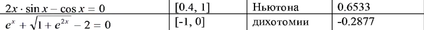

# Вариант № 10
**Сложность:** Стандартный

**Задание:**  Найдите корень следующих уравнений:
| Уравнение | Отрезок, содержащий корень | Метод | Приближённое значение корня(для сравнения) |
|----------|----------|----------|----------|

---