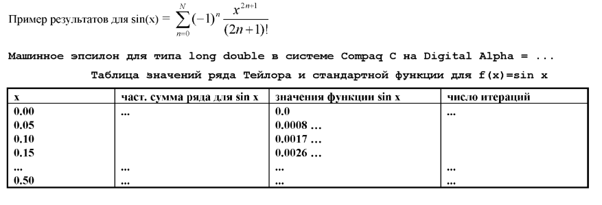

# Приближённые вычисления при помощи формулы Тейлора

В этой задаче предстоит поработать с вещественными числами.

- Прочтите [статью](https://courses.grainger.illinois.edu/cs357/fa2019/references/ref-1-fp/) про их хранение в памяти.

## Ошибки с округлением
Как в памяти хранить 1/3 = 0,333333...? Компьютер не способен хранить что-либо бесконечное, поэтому логичным шагом является округлить результат до определённой точности.  

Что напечатается?
```c
int main(){
    float a = 0.2;
    float b = 0.1;
    // Если равенство равно - напечатается YES, иначе NO
    a + b == 0.3f ? printf("YES\n") : printf("NO\n");
    printf("%.25f\n", 0.3f);
    printf("%.25f + %.25f = %.25f\n", a, b, a + b);
}
```
Спойлер: Напечатается YES. Но вывод выглядит так:
```
YES
0.3000000119209289550781250
0.2000000029802322387695312 + 0.1000000014901161193847656 = 0.3000000119209289550781250
```
Но числа совсем не равны точно 0.2 или 0.1. Чёрная магия.
Заменим float на более большой double(8 байт):
```c
int main(){
    double a = 0.2;
    double b = 0.1;
    // Если равенство равно - напечатается YES, иначе NO
    a + b == 0.3 ? printf("YES\n") : printf("NO\n");
    printf("%.25lf\n", 0.3);
    printf("%.25lf + %.25lf = %.25lf\n", a, b, a + b);
}
```
Тут уже получим NO:
```c
NO
0.2999999999999999888977698
0.2000000000000000111022302 + 0.1000000000000000055511151 = 0.300000000000000044408921
```

Вывод: double менее точный, но даёт больший диапазон значений.

- [Тут](https://bartaz.github.io/ieee754-visualization/) есть удобная визуализация хранения числа в памяти

## Машинное эпсилон
Вычислять его самостоятельно не нужно, эта константа лежит в `float.h`:
- `DBL_EPSILON` для double
- `FLT_EPSILON` для float

Все операции сравнения для вещественных чисел следует выполнять с некоторой точностью.
Заменим операции сравнения на новые:
- $$a == b \rightarrow abs(a - b) < EPS;$$
- $$a\neq b \rightarrow abs(a - b) \geq EPS;$$

## Ряд Тейлора
- [Если впервые про это слышите](https://www.geeksforgeeks.org/taylor-series/)

Само задание заключается в том, что необходимо посчитать значение функции двумя методами: при помощи готовой функции и при помощи ряда Тейлора для этой функции.

Метод вычисления по функции называется точным/аналитическим. А по Тейлору - приближённым. Последние изучают в курсе численных методов.

Дан отрезок `[a, b]`. Пользователь вводит `n` - число, на которое нужно разбить отрезок. Эти разбиения и будут значениями x, для которых нужно считать Тэйлора и значение фукнции.
Пример:
```
a = -1, b = 1, n = 10:
0) x = -1.0
1) x = -0.8
2) x = -0.6
3) x = -0.4
4) x = -0.2
5) x = 0.0
6) x = 0.2
7) x = 0.4
8) x = 0.6
9) x = 0.8
10) x = 1.0 (n + 1)
```
Кол-во итераций для Тэйлора ограничено числом `100`.

Второе число: `k` - это точность, с которой считаем Тэйлора:   
```EPS * k```

Т.е. можно увеличить EPS, тем самым снизив точность. `k` подбирается экспериментально - нужно такое значение, чтобы точность была максимальна и при этом вычисления укладываются в 100 итераций.

Результат необходимо вывести в виде таблицы (этот процесс называется табулированием функции):


## Задание

Вам необходимо решить задачу вашего варианта. Свой вариант можно найти [тут](variants.md).

## Важные требования к решению
Чтобы получить максимальный балл за задачу, необходимо удовлетворять следующим критериям:
- Эффективно вычисляется значение ряда Тэйлора.
- Выполняются все условия задачи.
- Код должен быть понятным, названия переменных отражают то, что они хранят.

