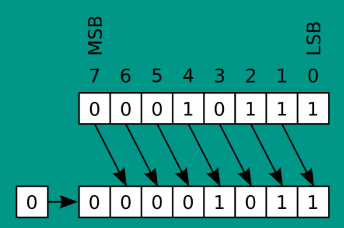
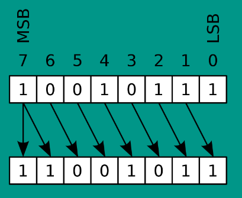
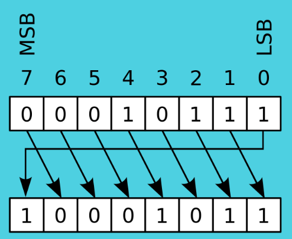

# Программирование машин Тьюринга

_The Turing machine is not a calculator; it is a machine that inspires awe, fuels imagination, and embodies the limits of our understanding_

---

В этой задаче вам нужно будет программировать на машине Тьюринга. Для этого необходимо [установить себе эмулятор](https://drive.google.com/file/d/1WTy1JMegmzlHeI-UD8AweAH8Qiwxba4W/view?usp=drive_link), выполняющий код прямо у вас в браузере на JavaScript


## Только в теории

Машина Тьюринга - абстракция, невозможная в реальном мире. Взять только бесконечную ленту.
На практике память компьютера небесконечна.

## Зачем же тогда она нужна?

Машина Тьюринга прекрасно подходит для теоретических доказательств. Применяется она в теории алгоритмов, про которую Вам подробно рассказывает В.Е.Зайцев на лекциях.

Подходит она прекрасно за счёт ограниченного языка взаимодействия. Если бы для теорем использовались существующие высокоуровневые языки, например, С++, то доказательства были бы на 300+ страниц. Потому что нужно доказать, что каждый компонент языка не протеворечит утверждению теоремы. Поэтому чем меньше у нас язык, тем легче что-то доказать.


## Ссылка на лекцию
Советую посмотреть [лекцию](https://www.youtube.com/watch?v=1Aer8prbQP8) на эту тему - живо, интересно, понятно. Позволит лучше разобраться в том, на чём будете программировать.

## Про практический аспект машины Тьюринга

Как на ней программировать? 

Есть две версии - МТ в четвёрках и в пятёрках.
В четвёрках запись выглядит так:
```(q, a, v, q')```,
</br>где
- q - текущее состояние.
- a - знак, который видим на ленте.
- v - знак, который пишем или команда.
- q' - состояние куда переходим.

Именно на ней Вы и будете писать. Для вызова справки нажмите на знак вопроса в эмуляторе.

Стоит отметить, что МТ в пятёрках выглядит так:
```(a, q, a', q', v)```,
</br>где
- q - текущее состояние.
- a - знак, который видим на ленте.
- a' - знак, на который заменим.
- q' - состояние куда переходим.
- v - команда, которую выполним после.

> Подумайте, как из пятёрок сделать четвёрки и из четвёрок сделать эквивалентную программу в пятёрках.

## Прямой, обратный и дополнительный код

- [Прочтите](https://microkontroller.ru/programmirovanie-mikrokontrollerov-avr/pryamoy-obratnyiy-dopolnitelnyiy-kod-dvoichnogo-chisla/) про кодирование чисел в памяти.

## Логический сдвиг
Двигаем в одну сторону. Тогда бит, который был справа пропадает, а на освободившимся месте появляется 0. Представьте, что число - это лавочка, а вы 0. Лавочка полностью заполнена. В таком случае, вы подходите к крайнему человеку справа и впихиваете себя рядом с ним - человек на другом конце лавочки благополучно падает с неё.  </br>
</br>
_Признавайтесь, кто делал так на уроках физкультуры)_
## Арифметический сдвиг
Сдвиг влево - логический сдвиг.</br>
Сдвиг вправо - сдвинутый бит пропадает, а на освободившееся место помещают знаковый бит.</br>
Запомнить очень просто: Сдвиг влево - это деление на два, сдвиг вправо - умножение на два. Потому и арифметический.</br>
</br>
> Убедитесь, что я не соврал и это действительно работает. Возьмите число 10(1001) и поприменяйте к нему этот сдвиг.
## Циклический сдвиг
Бит, который сдвинули, появляется на другом конце числа.</br>
</br>


## Задание

Вам необходимо решить задачу вашего варианта. Свой вариант можно найти [тут](variants.md).

Решение задачи пишите в ```.tu``` файле.

## Важные требования к программе
Чтобы получить максимальный балл за задачу, необходимо удовлетворять следующим критериям:
- Эффективный по времени работы алгоритм.
- `Нормированность`. Это когда ответ программы представлен в формате: ```input output```. Например, при бинарном сложении  ответ будет выглядеть так: ```110 1 111``` (110 + 1 = 111). На ленте нет лишних пробелов, промежуточных вычислений и не затёрты входные данные.
- Используется минимальное количество символов алфавита.
- Ограничения на входные данные минимальны или отсутствуют, т.е. программа верно отработает при любых валидных запросах.
- Код разделён на смысловые блоки. В нужных местах добавлены комментарии.
